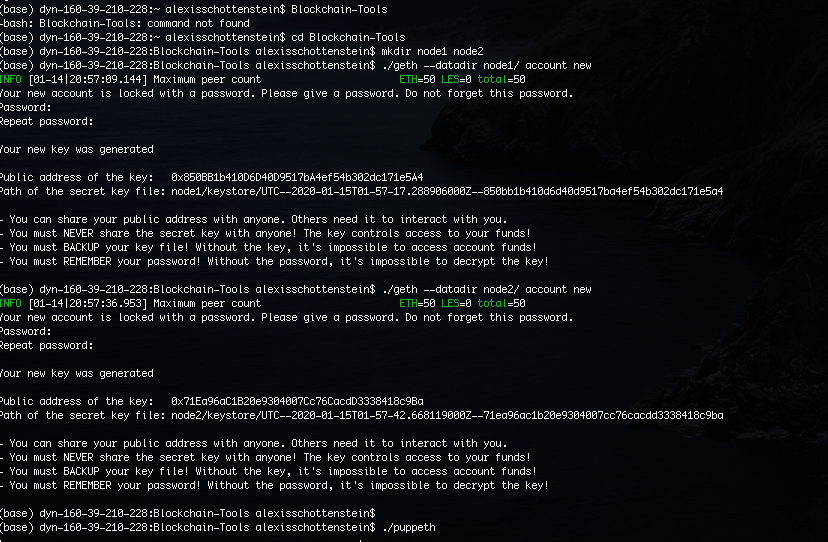
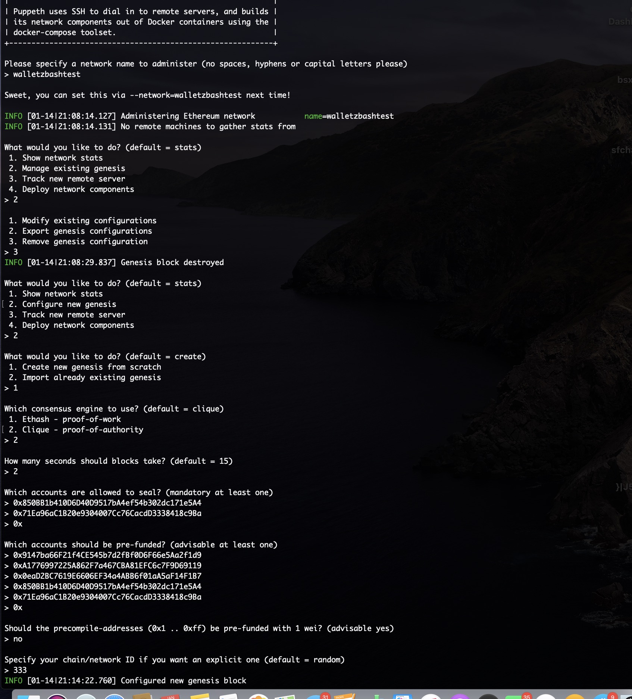
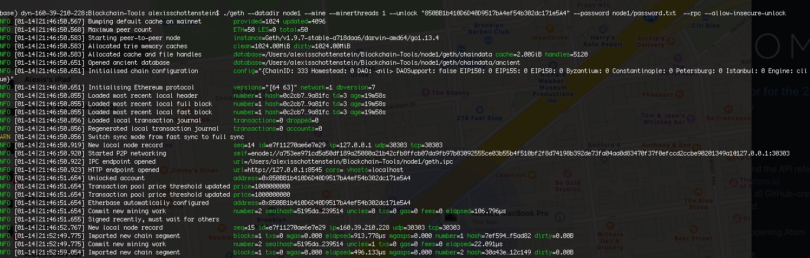
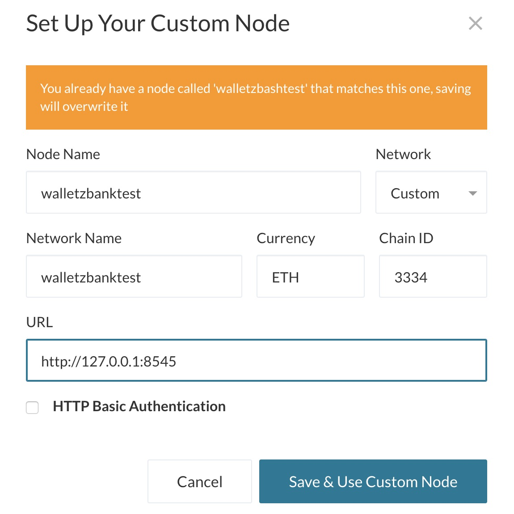
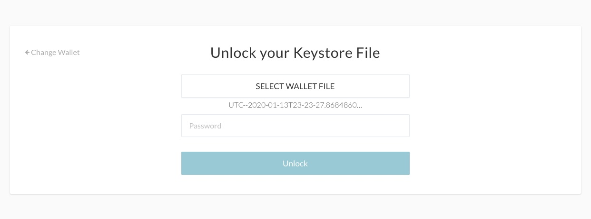
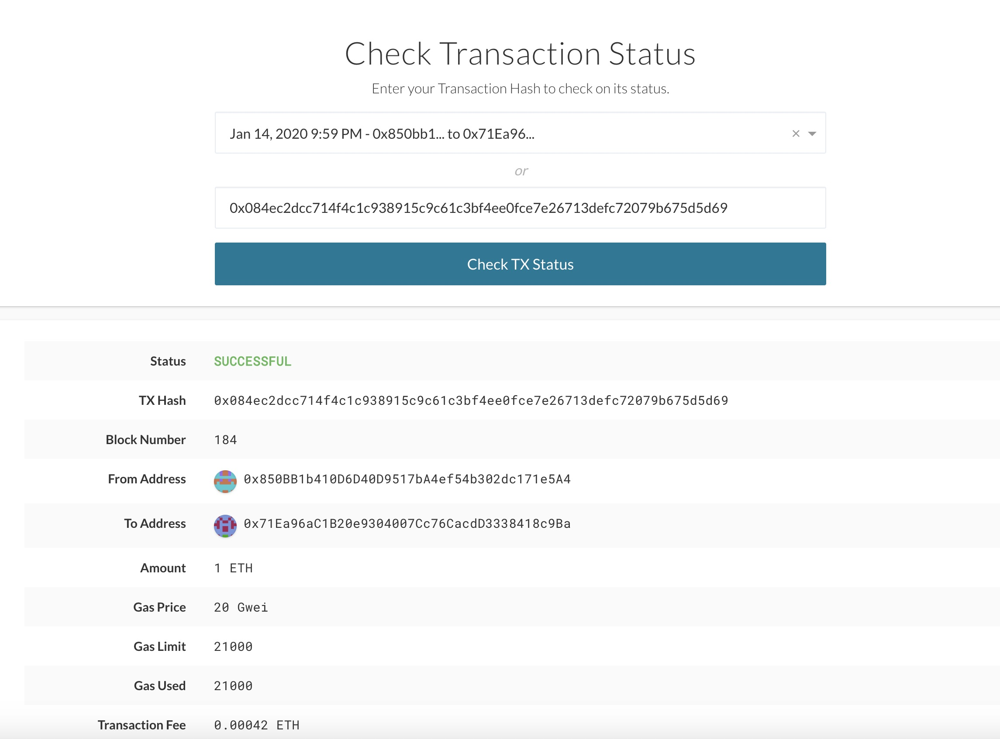

#  Proof of Authority Development Chain

## Contents
- [Proof of Authority Development Chain](#proof-of-authority-development-chain)
  * [Background](#background)
- [1. Blockchain Installation Guide](#1-blockchain-installation-guide)
    + [Installing MyCrypto Desktop App](#installing-mycrypto-desktop-app)
    + [MyCrypto Installation Notes](#mycrypto-installation-notes)
  * [Installing Go Ethereum Tools](#installing-go-ethereum-tools)
- [2. Instructions for POA Blockchain Transactions](#2-instructions-for-poa-blockchain-transactions)
  * [Creating Nodes](#creating-nodes)
  * [Running Puppeth](#running-puppeth)
  * [Setting Network info on MyCrpto](#setting-network-info-on-mycrpto)
    + [Remember, *never* share my mainnet private keys! This is a testnet, so coins have no value here!](#remember---never--share-my-mainnet-private-keys--this-is-a-testnet--so-coins-have-no-value-here-)
    + [Challenge mode](#challenge-mode)

- - -

For this assignment, I take on the role of a new developer at a small bank.My mission, should I choose to accept it, will be to set up a testnet blockchain for my organization.

To do this, I will create and submit four deliverables:

* Set up my custom testnet blockchain.

* Send a test transaction.

* Create a repository.

* Write instructions on how to use the chain for the rest of my team.

<details><summary>Background</summary>
## Background

You have just landed a new job at ZBank, a small, innovative bank that is interested in exploring what
blockchain technology can do for them and their customers.

My first project at the company is to set up a private testnet that I and my team of developers
can use to explore potentials for blockchain at ZBank.

You have decided on setting up a testnet because:

There is no real money involved, which will give my team of developers the freedom to experiment.

Testnets allows for offline development.

In order to set up a testnet, I will need to use the following skills/tools we learned in class:

* Puppeth, to generate my genesis block.

* Geth, a command-line tool, to create keys, initialize nodes, and connect the nodes together.

* The Clique Proof of Authority algorithm.

Tokens inherently have no value here, so we will provide pre-configured accounts and nodes for easy setup.

After creating the custom development chain, I create documentation for others on how to start it using the pre-configured
nodes and accounts. 

</details>

- - -

# 1. Blockchain Installation Guide
​
 I will use some software tools and utilities to interact with blockchains and to create my very own blockchain from scratch.
​​
**Important Note:** Windows users **MUST** use `git-bash` and not the default Windows command prompt when I are requested to open the terminal window to execute commands.
​
### Installing MyCrypto Desktop App
​
[MyCrypto](https://www.mycrypto.com/) is a free, open-source, client-side interface that allows I to interact directly with the blockchain.
​
For this example, we will use MyCrypto Desktop App to manage ethereum wallets and make transactions in the blockchain.
​
To install MyCrypto Desktop App, please follow the next steps:
​
1. Open my browser and navigate to the downloads page at https://download.mycrypto.com/.
​

2. Depending on my operating system, you will be redirected to the corresponding application installer. If you are not correctly redirected, choose the appropriate installer for my operating system.
​
3. Once you download the installer, open the file, and follow the installation wizard. 
​
### MyCrypto Installation Notes
​
General Notes:
​
* The first time you execute MyCrypto, you will see the following starting tutorial, we suggest to read trough as I click "Next" to continue.
​
​
Running in OS X:
​
* The first time I execute MyCrypto, I will see the following warning message, I can safely click on the "Open" button to start the application.
​
​
## Installing Go Ethereum Tools
​
[Go Ethereum](https://geth.ethereum.org/) is one of the three original implementations of the Ethereum protocol. It is written in Go, fully open-source and licensed under the GNU LGPL v3.
​

In this example, we will use Go Ethereum Tools to create our very own blockchain, from the genesis block to mining tokens and making transactions.
​

Despite there are installers for OS X and Windows, we will use the application executable binary files to have a seamless experience between both operating systems and avoid some technical issues that currently exist in Windows.
​
To install the Go Ethereum Tools, please follow the next steps:
​
1. Open my browser and navigate to the Go Ethereum Tools download page at https://geth.ethereum.org/downloads/
​
2. Scroll down to the "Stable Releases" section and proceed depending on my operating system.
​
 2.1. Installing in OS X.
 Click on the **"Geth & Tools 1.9.7"** to download the applications bundle archive.
​
 2.2. Installing in Windows.

  - You need to know if I are running a `32 bit` or `64 bit` version of Microsoft Windows, if I are not sure about that, I can check my version following [these steps](https://support.microsoft.com/en-us/help/13443/windows-which-version-am-i-running).


 -  Depending on my Windows version, I should download the `32 bit` or `64 bit` version of the Go Ethereum Tools.
​
3. After downloading the tools archive, open my "Downloads" folder, and I will find a file named `geth-alltools-darwin-amd64-1.9.7-a718daa6.tar.gz` in OS X, and a file called `geth-alltools-windows-amd64-1.9.7-a718daa6.zip` in Windows. Note that the last numbers in the filename could vary depending on the last built available.​

4. Decompress the archive in the location of my preference in my computer's hard drive, and rename the containing folder as `Blockchain-Tools`. We recommend using a location that can be easily accessed from the terminal window like the user's home directory.

5. You have finished the installation process; I will use these tools to create my very own blockchain!
​

# 2. Instructions for POA Blockchain Transactions 

##  Creating Nodes

1. Add a empty directory for nodes 
```bash
mkdir node1 node2
```
2. Get new accounts numbers from nodes to use as signers
```bash
./geth account new --datadir node1
./geth account new --datadir node2
```
 

3. password "node1" (repeat)
​

4. repeat above for node2
​
5. Save passwords & Account addresses for use later
```bash
echo 'node1pswd' > node1/password.txt
echo 'node2pswd' > node2/password.txt
```

```bash
echo 'NODE1adress' >> accounts.txt
echo 'NODE2adress' >> accounts.txt
```




## Running Puppeth
1. Open a terminal window (GitBash in Windows) navigate to my `Blockchain-Tools` folder and type the following command:
​
  ```bash
  ./puppeth
  ```
​

2. `>zbashtestwallet` <- name of network​

3. Type `2` to pick the `Configure new genesis` option, then `1` to `Create new genesis from scratch`:
​
4. Type `1` to choose `Proof of Work` and continue.
​
5. Addresses: Uses those assocated with cloud mneumonic
Use MyCrypto like from the previous class, and explain to the students that in this step is where we are going to pre-fund any accounts.
​
6. Once I paste an address and hit enter, hit enter again on the blank 0x address to continue the prompt.
​
7. Continue with the default option for the prompt that asks, Should the precompile-addresses (0x1 .. 0xff) be pre-funded with 1 wei? by hitting enter again until I reach the Chain ID prompt. You can select no here to keep the genesis block cleaner.
​
8. come up with a number to use as a "chain ID" or make one up myself, like 333, for example.
​
9. In the `puppeth` prompt, navigate to the `Manage existing genesis` by typing `2` and hit enter.
​
10. Next, type `2` again to choose the `Export genesis configurations` option, then continue with the default (current) directory:
​
11. Show files in Blockchain-Tools folder. Show json file.
​
12. Exit the puppeth prompt by using the Ctrl+C keys combination.
​




​
## Starting the Blockchain

1. Initialize nodes
```bash
./geth init puppernet.json --datadir node1
./geth init puppernet.json --datadir node2
```

2. launch the first node into mining mode with the following command:
```bash
#Alternately use --mine console to open up java console and other options such as roc api can be used to protect your transactions this is just to get running

./geth --datadir node1 --mine --minerthreads 1 --unlock "NODE1_address" --password node1/password.txt  --rpc --allow-insecure-unlock
```
-  copy the entire `enode://` address (including the last `@address:port` segment) of the first node located in the `Started P2P Networking` line:



3. Launch second node 
```bash
./geth --datadir node2 --unlock "NODE2_address" --mine --port 30305 --bootnodes enode://YOUR_ENDCODE_FROM_NODE1 --password node2/password.txt  --allow-insecure-unlock
```
​
  **Note**: If I ever encounter strange errors, or need to start over without destroying the accounts, run the following command to clear the chain data (this will reset the `enode` addresses as well):
​
  ```bash
  rm -Rf node1/geth node2/geth
  ```
​
- - -
​
## Setting Network info on MyCrpto
For the nodes to speak to eachother a new custom network must be created. 

1. Click on "Add Custom Node", then add the custom network information that was set in the genesis.
​
2. Ensure that I scroll down to choose `Custom` in the "Network" setting to reveal more options like `Chain ID`:
​
3. The chain ID must match what I came up with earlier.
​
4. The URL is pointing to the default RPC port on my local machine. Everyone should use this same URL: `http://127.0.0.1:8545`.
​
Click on the "Save & Use Custom Node" button, to use the network; double-check that it is selected and is connected.
​





5. Import the keystore file from th e `node1/keystore` directory into MyCrypto. This will import the private key.



6. Send a transaction from the `node1` account to the `node2` account.

7. Copy the transaction hash and paste it into the "TX Status" section of the app, or click "TX Status" in the popup.

8. The transaction is should now read Succesfull! C with the metadata (status, tx hash, block number, etc).

9. Celebrate, I just created a blockchain and sent a transaction!



### Remember, *never* share my mainnet private keys! This is a testnet, so coins have no value here!

### Challenge mode

* Create a separate `bootnode` dedicated to connecting peers together

* There will be a new DevOps engineer joining the team, add an additional sealer address to the network on the fly!
